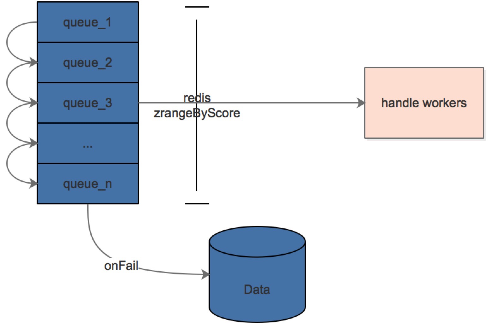

## 项目说明
- 一套较通用的failover机制实现,基本的做法就是不断的尝试去请求接口,直到返回成功为止,适用于一些对请求/通知信息可靠性较高的情形

- 基于redis的zset实现,一部分元数据亦保存在redis中,目前仅支持主从模式的redis(Sentinel)，后续考虑加入cluster方式的redis

- 接口说明:

```
public interface FailoverHandler {
    // 处理方法
    Object handle(Object obj);

    // 处理失败
    void onFail(Object obj);
}

```

handle 为需要实现的业务代码逻辑 ，onFail方法为重试次数到达上限后回调的方法,用户需要在此处理失败的数据(打log,写库等)

- 使用方法
	- spring配置文件方式: 引入classpath*:/META-INF/spring-failover.xml
	- annotation方式: 增加commponent-scan 包名:com.gzs.learn.failover
- 业务代码中注入FailoverService实例 ，调用failoverService的doFailover方法

- 代码示例可参见src/test/java 下面的DemoTest示例类

## 配置参数说明：

|配置项                  	|     	描述                        		| 	示例						|
|:------------------------	|:------------------------------------	|:-------------------------	|
|failover_seq  		    	|重试间隔,第一个指定时间单位,可以是ms(毫秒),s(秒),m(分钟),h(小时) |ms,10,30|
|failover_set_prefix	  	|redis key值前缀,建议使用包名		      	|com.gzs.learn.cashier		|
|failover_work_count	  	|处理队列数据的worker数量					| 20(默认值为10)				|

## 整体设计图：


## FAQ
- 重试线程的运行间隔为20ms,如需要更短的重试间隔机制可以考虑修改FailoverInit 类下的THREAD_SLEEP_INTERVAL值
- 与HttpClient重试机制的区别,HttpClient可以指定重试次数(短时间内重试),但当服务方宕机或者一段时间内不可用的情形,此框架可以保存请求数据,并按照既定的时间间隔进行重试